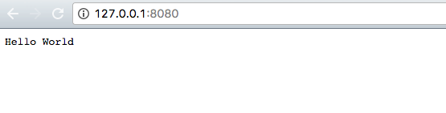

# Hello HTTP Server
> A very simple web server that will only respond to a basic request for http://localhost:8080/.

This was my fourth project at Origin Code Academy. This server was created using NodeJS.



## Approach

This was a straightforward app to demonstrate the simplicity of running a server using NodeJS.

## Installation

Download all associated files and load them up in your favorite text editor!

## Development setup

This app relies on NodeJS for its functionality. To run this server use [nodemon](https://www.npmjs.com/package/nodemon).

```sh
npm install -g nodemon
// cd to-your-web-folder
nodemon
```

## Contact Information

Twitter: [@adriftinthesea](https://twitter.com/adriftinthesea)

Email: z@zamarise.com

GitHub: [https://github.com/zamarise](https://github.com/zamarise/)
